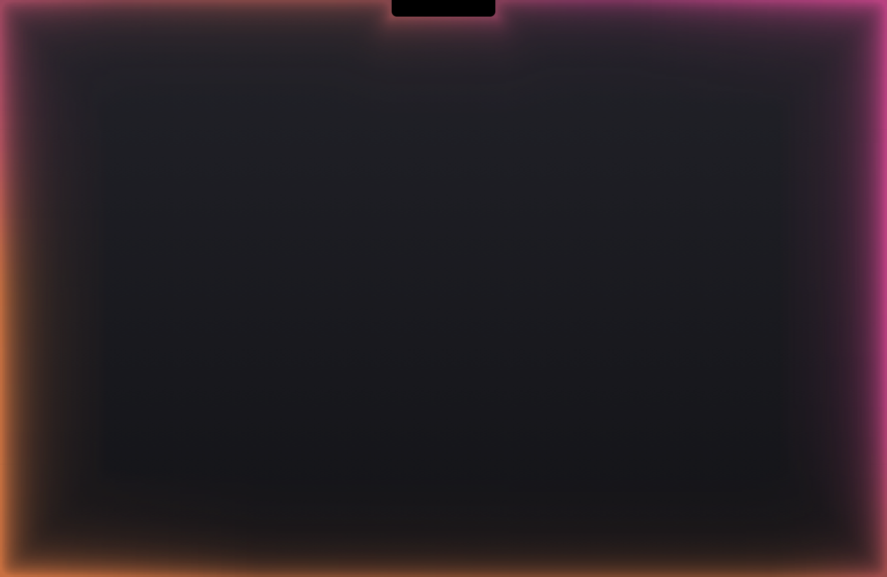
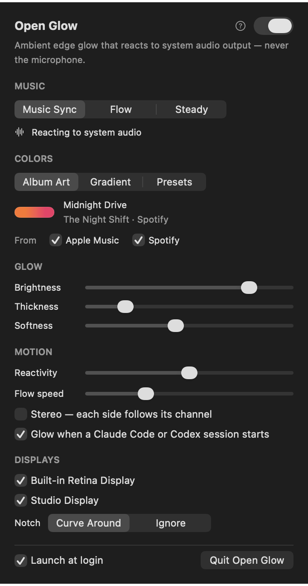
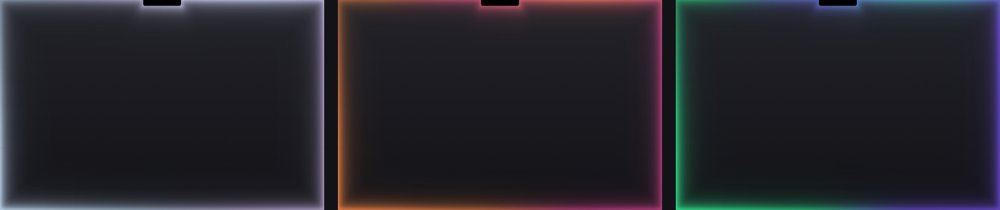

<div align="center">

# Open Glow

**Ambient light for the edges of your Mac's screen — in the colors of what you're listening to, moving with the music.**



[Features](#features) · [Install](#install) · [Permissions](#permissions) · [Using it](#using-open-glow) · [Troubleshooting](#troubleshooting) · [How it works](#how-it-works)

</div>

---

Open Glow is a small, free, open-source menu-bar app for macOS. It lights the edges of your screen
like a soft bias light: the colors come from the album art of the song you're playing, flow slowly
around the screen, and swell with the music — big hits send light rushing along the edges, quiet
passages let it breathe.

It listens to your Mac's **audio output**, never the microphone.

## Features

- **Edge light** — light that pours in from the screen edges, brightest at the edge and fading
  smoothly inward, with soft corners and a proper wrap around the notch.
- **Album colors** — two colors taken from the now-playing track's artwork in Apple Music or
  Spotify, cross-fading on every track change. Black-and-white covers glow white; pastel covers
  stay soft.
- **Music Sync** — beats become smooth swells that travel along the edges: the bigger the hit, the
  bigger the swell. Optional stereo mode lets each side follow its own channel.
- **Flow** — with no music (or in Flow mode), the colors drift around the screen in soft blobs.
- **Coding-session glow** — optionally, a sweep of Claude's warm orange when a Claude Code session
  starts, or Codex's colors when a Codex session starts.
- **Timers and Pomodoro** — the whole edge lights up and the light recedes around the screen as
  time runs out, with the countdown in place of the menu-bar icon and soft pulses at the end.
- **Your own colors** — a two-color gradient with a blend slider, or one of the presets.
- **Opening sweep** — light rises from the bottom of the screen and meets at the top whenever Open
  Glow starts.
- **Welcome tour**, per-display toggles, launch at login, and every setting applies live.
- **Light on resources** — no dependencies, no private APIs; see [Performance](#performance).

## Screenshots

| Music Sync | Flow |
|---|---|
|  |  |

| Opening sweep | Settings |
|---|---|
|  |  |

Different palettes — the soft default, a warm album, a cool album:



## Requirements

- macOS 26 or later, Apple silicon
- To build: Swift 6 — Xcode, or just the Command Line Tools (`xcode-select --install`)

## Install

**Download:** grab `Open-Glow-<version>.dmg` (or the `.zip`) from the
[latest release](https://github.com/Ayanprakash35/Open-glow/releases/latest), drag **Open Glow**
to Applications, then see [Running a build you downloaded](#running-a-build-you-downloaded) — the
app isn't notarized, so macOS needs one command before it will open it.

**Build it yourself** (about a minute):

```bash
git clone https://github.com/Ayanprakash35/Open-glow.git
cd Open-glow
./Scripts/setup_signing.sh      # once — see "Signing" below
./Scripts/build_app.sh          # builds and signs build/Open Glow.app
open "build/Open Glow.app"
```

Copy `build/Open Glow.app` to `/Applications` if you like. Always start it through `open` (or
Finder), not by running the binary inside it — macOS then checks Open Glow's own permissions
rather than your terminal's.

### Signing

macOS remembers privacy permissions per app *identity*. An ad-hoc signature's identity is a hash of
the exact binary, so every rebuild would look like a new app and lose its permissions.
`Scripts/setup_signing.sh` creates a local, self-signed **"Open Glow Dev"** code-signing identity
once, in its own keychain (`~/Library/Keychains/openglow-signing.keychain-db`), and
`Scripts/build_app.sh` signs with it automatically, so permissions survive rebuilds. The setup
script is safe to run again: it says "Already set up" when everything works, and repairs a
half-finished setup (it starts over, so macOS asks for Open Glow's permissions once more). To
remove it:

```bash
security delete-keychain ~/Library/Keychains/openglow-signing.keychain-db
rm -r ~/Library/Application\ Support/Open\ Glow\ Dev\ Signing
```

Without it, `build_app.sh` signs ad-hoc. If the identity is there but can't be used, the build
still finishes: it prints a warning and signs ad-hoc instead. You can also sign with any identity
of your own, `OPENGLOW_SIGN_IDENTITY="My Identity" ./Scripts/build_app.sh`, or force ad-hoc with
`OPENGLOW_SIGN_IDENTITY=-`.

### Running a build you downloaded

Release builds are signed ad-hoc and not notarized, so macOS quarantines the download and won't
open it. Clear the quarantine flag (and, for a copy from anywhere else, re-sign it ad-hoc):

```bash
xattr -dr com.apple.quarantine "/Applications/Open Glow.app"
codesign --force --deep --sign - "/Applications/Open Glow.app"   # only for copies from elsewhere
```

An ad-hoc signature changes with every version, so after updating, macOS may ask for Screen &
System Audio Recording again (if Music Sync stops reacting, see
[Troubleshooting](#troubleshooting)).

## Permissions

Open Glow asks for as little as it can, and only when a feature needs it. The welcome tour walks
through each one.

| Permission | Why | Where |
|---|---|---|
| **Screen & System Audio Recording** | Music Sync reads your Mac's audio output through ScreenCaptureKit, which macOS puts behind this permission. Open Glow never looks at the screen's contents. | System Settings › Privacy & Security › Screen & System Audio Recording |
| **Automation** (Music, Spotify) | Reads the current track and its artwork to color the glow. Open Glow never controls playback. macOS asks the first time a track plays. | System Settings › Privacy & Security › Automation |
| **Login Items** (optional) | Launch at login. | System Settings › General › Login Items |

There is no microphone permission — Open Glow never uses the microphone.

**Network.** Only album colors ever use the network, and only with Album Art as the color source
and a player ticked under **From**. A player you untick is ignored completely — no Apple Events,
no Automation prompt, no downloads.

- **Apple Music, streamed tracks:** Music gives other apps no artwork for these, so Open Glow looks
  the cover up in Apple's public iTunes Search API (`itunes.apple.com`, over https, no cookies):
  the artist and title, then — only if that finds nothing — the artist and album, each with your
  Mac's two-letter region code so the right store answers. The cover itself then comes from
  Apple's image server.
- **Apple Music, your own files:** their artwork comes from Music. A lookup happens only if Music
  has no artwork for the track.
- **Spotify:** the cover is downloaded from Spotify's image server (`i.scdn.co`), the address
  Spotify itself reports. A lookup as above happens only if there's no usable cover.
- Each track is looked up at most once, and not again while its colors are among the last 32
  remembered. Nothing else leaves your Mac.

## Using Open Glow

Open Glow lives in the menu bar. **Click** the icon for everything — settings, the timer and coding
sessions; **right-click** (or Control-click) for a quick menu of the same options and Quit. The welcome tour opens on first launch; reopen
it from the right-click menu or the **?** in the settings popover.

### Animation

| Mode | What it does |
|---|---|
| **Music Sync** | Swells with whatever's playing; drifts gently when it's quiet. |
| **Flow** | Colors drift around the screen; audio is ignored and nothing is captured. |
| **Steady** | Holds still. |

**Reactivity** sets how big the swells get, **Flow speed** how fast the colors travel, and
**Stereo** lets the left and right edges follow their own channels. With the system's
**Reduce Motion** setting on, nothing travels or drifts; music still brightens the glow.

### Colors

- **Album Art** — from the track playing in Apple Music or Spotify (choose which in settings).
- **Gradient** — your own two colors and how much of the edge each covers.
- **Presets** — Mist, Dusk, Lagoon, Ember, Aurora, Citrus, Rose, Glacier.

### Glow

**Brightness**, **Thickness** (how far the light reaches inward) and **Softness** (how much of it
is a faint, wide bloom). Turn individual displays on or off, and choose whether the light curves
around the notch.

### Timers and Pomodoro

Click the menu-bar icon › **Timer**: pick a **Countdown** — 5, 10, 15, 25 or 45 minutes, an hour,
or **Custom…** (minutes, or h:mm like 1:30, up to 24 hours) — or **Start Pomodoro (25/5)**: four
25-minute focus rounds with 5-minute breaks, then a 15-minute long break that ends the session.

While a timer runs, the whole edge starts lit and the light recedes smoothly clockwise from the
top as time runs out; the countdown replaces the menu-bar icon (with a warning triangle in front
of it if Music Sync needs attention); each phase ends with three soft pulses and a gentle chime.
The Timer section then shows the phase and time left with **Pause**/**Resume**, **Skip to
Break**/**Skip Break** (**Finish Pomodoro** on the long break) and **Cancel Timer**. Time keeps
counting while the Mac sleeps.

### Coding sessions

Tick **Glow when a coding session starts** and Open Glow plays a short sweep in Claude's colors
when a Claude Code session starts, or Codex's colors for Codex — from the terminal or the Claude
app. It notices sessions by watching for their processes (a quick look at the process list every
1.5 s, about 0.04 ms each time); nothing is sent anywhere.

## Troubleshooting

**Music Sync doesn't react.** Open the popover — it says what's wrong. If Screen & System Audio
Recording shows Open Glow enabled but nothing happens, macOS is holding a grant for an older build:

```bash
tccutil reset ScreenCapture com.openglow.app
```

then grant it again from the popover and relaunch. Running `Scripts/setup_signing.sh` once stops
this from happening after rebuilds.

**Colors don't change with the song.** Make sure Album Art is selected and the player is enabled in
settings. If you declined the Automation prompt: `tccutil reset AppleEvents com.openglow.app`,
then play a track and allow it. Streamed Apple Music tracks need a network connection for their
artwork. Black-and-white covers glow white on purpose.

**My Bluetooth headphones sound muffled.** That's the headphones' "headset" mode, which macOS
switches to when *some* app opens their microphone (check System Settings › Sound › Input).
Open Glow never opens the microphone.

**Nothing on the lock screen.** By design — macOS gives apps no public way to draw there, and Open
Glow pauses completely (rendering and audio capture) while the screen is locked, the screen saver
runs, or another user is switched in. Timers keep counting.

**Watching the logs.** In zsh, `log` is a built-in, so use the full path:

```bash
/usr/bin/log stream --level info --predicate 'subsystem == "com.openglow.app"'
```

## Tuning

Every number that shapes the look and feel is a named constant at the top of its file, with its
unit and a sensible range:

| Constants | File | Controls |
|---|---|---|
| `GlowMotionConfig` | `GlowMotion.swift` | Flow speed, swell rise and fall, beat weight, stereo, opening and coding-session sweeps, frame rates |
| `TimerRingConfig` | `GlowTimerRing.swift` | Timer ring and finish pulses |
| `GlowFrameConfig` | `GlowRenderer.swift` | Display-link pacing, strip rebuilds while a slider moves |
| `PomodoroConfig` | `GlowTimer.swift` | Focus, break and long-break lengths |
| `CodingSessionConfig` | `CodingSessionMonitor.swift` | How often sessions are looked for, and each tool's colors |
| `EdgeLightConfig` | `EdgeLightRasterizer.swift` | Falloff shape, tail, resolution |
| `EdgeGeometryConfig` | `EdgeGeometry.swift` | Corner roundness |
| `GlowDefaults` | `GlowRenderer.swift` | Default brightness, thickness, softness |
| `EnvelopeConfig`, `FFTConfig` | `BeatDetector.swift` | Beat detection and grading, loudness tracking |
| `ColorExtractorConfig` | `ColorExtractor.swift` | How colors are picked from artwork |
| `ArtworkLookupConfig`, `AlbumArtConfig` | `ArtworkLookup.swift`, `ColorCoordinator.swift` | Artwork lookup and caching |

## How it works

- **Capture** — `AudioEngine` runs a ScreenCaptureKit stream with audio only (its video is a
  2×2-pixel stub at 1 fps, which ScreenCaptureKit requires) and writes 48 kHz stereo samples into
  a lock-protected ring buffer.
- **Analysis** — `BeatDetector` runs an FFT per 512-sample hop on its own queue: band energies
  with adaptive loudness normalization, and a SuperFlux-style onset detector on two bands (kick and
  full) that fires beats and grades each one by size.
- **Motion** — `GlowMotion` keeps the state of 480 points around the screen: colors from a slowly
  flowing field split between the palette's two colors, an idle drift of brighter and dimmer
  patches, and in Music Sync an envelope that turns beats into swells travelling outward along the
  edges.
- **Rendering** — `EdgeLightRasterizer` turns that state into strip images along the edges (the
  corners, the notch, the spans between them and the sides) — light falling off smoothly from the
  edge — computed with integer math in the display's own color space and handed to Core Animation
  as IOSurfaces (no per-frame copy);
  `GlowView` shows them scaled up smoothly in a click-through window above everything on each
  display. Nothing is drawn while the glow holds still or its window isn't visible.
- **Colors** — `NowPlayingMonitor` follows Music and Spotify through their notifications and
  AppleScript; `ArtworkLookup` finds covers for streamed tracks; `ColorExtractor` picks two colors
  with k-means in CIELAB.

```
Sources/OpenGlow/
  AppDelegate.swift             menu bar, popover, capture lifecycle
  MusicSyncPlan.swift           what capture should do, as a pure decision
  ScreenSessionMonitor.swift    lock, sleep, screen saver, fast user switching
  CaptureRecovery.swift         retries and recovery after capture stops
  Settings.swift                every preference, persisted
  SettingsView.swift            the popover
  StatusMenu.swift              the right-click menu
  StatusModel.swift             what the popover and icon say about Music Sync
  Onboarding*.swift             the welcome tour
  DisplayManager.swift          one overlay window per display
  OverlayWindowController.swift the click-through overlay window
  GlowRenderer.swift            GlowView: layers and frame pacing
  GlowMotion.swift              what the light does from moment to moment
  GlowAccent.swift              the coding-session sweep
  GlowTimerRing.swift           the receding timer ring and finish pulses
  EdgeLightRasterizer.swift     state → pixels
  EdgeGeometry.swift            distance from the edge, position around the screen
  AudioEngine.swift             system-audio capture
  AudioRingBuffer.swift         capture → analysis hand-off
  BeatDetector.swift            FFT, beats, loudness
  Median.swift                  fast medians for the onset thresholds
  ColorCoordinator.swift        which palette to show
  NowPlaying*.swift             Music and Spotify
  ArtworkLookup.swift           covers from Apple's catalog
  ColorExtractor.swift          artwork → palette
  GlowPalette.swift             colors and presets
  CodingSession*.swift          Claude Code and Codex sessions
  ProcessTable.swift            reading the process list (libproc)
  GlowTimer.swift               timer and Pomodoro model
  TimerController.swift         the running timer
  TimerMenu.swift               timer labels and the menu-bar countdown
  TimerPanel.swift              the popover's Timer section
  TimerPresenter.swift          timer → ring, pulses and countdown
  LaunchAtLogin.swift           SMAppService
```

## Performance

Open Glow does almost nothing when there's nothing to show: no frames are drawn while the glow
holds still (Steady mode) or is hidden, and analysis only runs while music plays. Measured on a
15-inch MacBook Air:

| Work | Cost |
|---|---|
| Drawing one frame of the edge light (1710 × 1112 pt display) | 0.06 ms |
| Analysing one second of music (FFT, beats, loudness) | ≈ 0.5 ms |
| Checking for new coding sessions (every 1.5 s) | ≈ 0.04 ms |
| Steady mode | 0% CPU |

Frames run at about 20 fps for the idle flow at the default Flow speed (10–30 with the speed), and
at 30 fps with music — 60 only while a swell changes fast. While music plays, analysis runs once per
audio delivery from the system (≈ 47 a second) with no extra timer wake-ups. The full numbers, and how
they were measured, are in [docs/MEASUREMENTS.md](docs/MEASUREMENTS.md); the story behind them is
in [docs/DEVLOG.md](docs/DEVLOG.md).

## Contributing

Issues and pull requests are welcome — see [CONTRIBUTING.md](CONTRIBUTING.md) for setup, ground
rules (no dependencies, no private APIs, never the microphone) and code style.

## Acknowledgements

Inspired by ambient lighting — the soft bias light behind a TV, and ambient edge-lighting
visuals on the desktop. Open Glow is an independent project and isn't affiliated with any other
app.

## License

[MIT](LICENSE)
